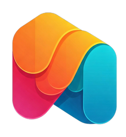

<div align="center">
  

  # Paper Thin 🖼️
  
  [](https://apps.apple.com/app/paper-thin)
  [](https://play.google.com/store/apps/details?id=paperthin.app)
  [](https://paper-thin.vercel.app)
  [](LICENSE)
</div>

## 🌟 Overview

A modern wallpaper discovery app built with Framework7. Features a beautiful interface for browsing, collecting, and downloading wallpapers from multiple sources.

<div align="center">
  
</div>

## ✨ Features

- 🖼️ Browse wallpapers from multiple sources
- 📱 Progressive Web App (PWA) support
- 🌙 Dark mode support
- 💾 Save wallpapers to collections
- 🎲 Random wallpaper discovery
- 📱 Mobile-first responsive design
- ⚡ Fast loading with image optimization
- 🔍 Search functionality
- 📂 Category filtering

## 🚀 Quick Start

### Prerequisites

- Node.js 16+
- npm 7+
- Git

### Installation

1. Clone the repository
```bash
git clone https://github.com/Mr-vero/PaperThin
cd paper-thin
```

2. Install dependencies
```bash
npm install
```

3. Start development server
```bash
npm run dev
```

## 📱 Platform Builds

<details>
<summary>🌐 Web Deployment</summary>

### Build for Web
```bash
npm run build
```

### Deploy Options

#### ▲ Vercel
```bash
vercel www
```

#### 🔥 Firebase
```bash
firebase deploy --only hosting
```

[View all web deployment options](#web-deployment)
</details>

<details>
<summary>📱 iOS Build</summary>

### Prerequisites
- macOS
- Xcode 14+
- iOS Developer Account

### Build Steps
```bash
npx cap add ios
npm run build-capacitor-ios
```

[View detailed iOS instructions](#ios-build)
</details>

<details>
<summary>🤖 Android Build</summary>

### Prerequisites
- Android Studio
- JDK 11+

### Build Steps
```bash
npx cap add android
npm run build-capacitor-android
```

[View detailed Android instructions](#android-build)
</details>

<details>
<summary>🖥️ Desktop Apps</summary>

### Build for all platforms
```bash
npm run electron:build
```

[View desktop build instructions](#desktop-apps)
</details>

## 📖 Documentation

- [Framework7 Core Documentation](https://framework7.io/docs/)
- [Capacitor Documentation](https://capacitorjs.com/docs)
- [Electron Documentation](https://www.electronjs.org/docs)

## 🛠️ Technology Stack

| Technology | Purpose |
|------------|---------|
| Framework7 | UI Framework |
| Capacitor | Native Platform |
| Vite | Build Tool |
| Electron | Desktop Apps |

## 📊 Project Structure

```
paper-thin/
├── src/              # Source files
├── www/              # Built files
├── capacitor.config.json
└── package.json
```

## 🤝 Contributing

1. Fork the Project
2. Create your Feature Branch (`git checkout -b feature/AmazingFeature`)
3. Commit your Changes (`git commit -m 'Add some AmazingFeature'`)
4. Push to the Branch (`git push origin feature/AmazingFeature`)
5. Open a Pull Request

## 📝 License

This project is licensed under the MIT License - see the [LICENSE](LICENSE) file for details.

## 🙏 Acknowledgments

- Framework7 team for the amazing framework
- All our contributors and supporters

## 📞 Support

- Create an issue
- Follow me on Instagram: [Instagram](https://instagram.com/mr_vero)
- Email: mr.vero@usa.com

## 🔄 Changelog

See [CHANGELOG.md](CHANGELOG.md) for details.

## 🗺️ Roadmap

- [ ] Add more wallpaper sources
- [ ] Implement AI-powered recommendations
- [ ] Add social sharing features
- [ ] Improve offline support

## 📈 Statistics


